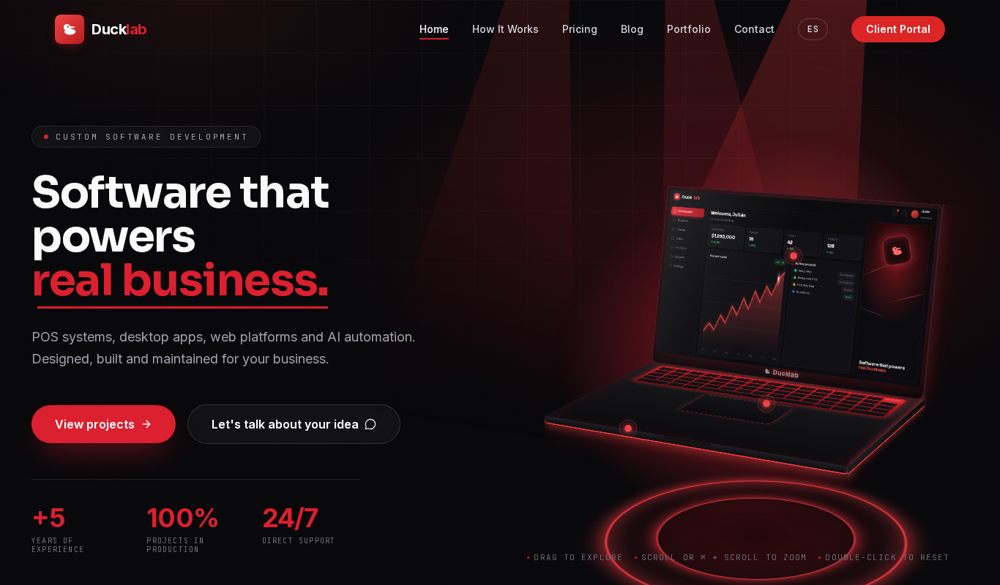

# Ducklab

**Portal de clientes + Launcher de escritorio** para distribución de software personalizado.

Cada cliente tiene su propia cuenta con acceso a sus aplicaciones, descargas seguras, soporte técnico y gestión de pagos. Como Steam, pero para sistemas POS y software a medida en Colombia.

**Demo:** [ducklab.onrender.com](https://ducklab.onrender.com)



---

## Stack

| Capa | Tecnología |
|------|-----------|
| Frontend Web | Next.js 16, React 19.2, CSS Modules |
| Backend Web | Server Actions, Route Handlers |
| Auth | JWT (jose), bcryptjs, cookies HttpOnly |
| Base de Datos | JSON file → PostgreSQL (próximamente) |
| Launcher Desktop | Python 3, PyQt5, requests |

---

## Empezar

### Requisitos
- Node.js 20.9+
- Python 3.10+ (solo para el launcher)

### Web

```bash
npm install
npm run dev
```

Abrir [http://localhost:3000](http://localhost:3000)

### Launcher Desktop

```bash
cd launcher
pip install -r requirements.txt
python main.py
```

---

## Credenciales de Prueba

> ⚠️ Las contraseñas de producción son secretas y se rotan. Nunca escribir
> contraseñas reales en este archivo ni mostrarlas en capturas de pantalla.

| Email | Rol | Plan |
|-------|-----|------|
| carlos@empresa.com | Cliente | Profesional |
| maria@negocio.co | Cliente | Básico |
| admin@jrdev.co | Admin | — |

---

## Estructura

```
mi-plataforma/
├── src/
│   ├── app/           # Web (Next.js App Router)
│   │   ├── login/     # Login con autenticación
│   │   ├── dashboard/ # Portal privado del cliente
│   │   │   ├── downloads/   # Descargas seguras
│   │   │   ├── tickets/     # Tickets de soporte
│   │   │   └── payments/    # Historial de pagos
│   │   └── api/       # API REST
│   └── lib/           # Lógica compartida
│       ├── db.js      # Base de datos
│       ├── session.js # JWT sessions
│       ├── dal.js     # Data Access Layer
│       └── actions/   # Server Actions
│
├── launcher/          # App de escritorio (Python)
│   ├── main.py        # Entry point
│   ├── ui/            # Ventanas PyQt5
│   └── lib/           # API client, session, updater
│
├── data/              # Datos persistentes
├── ARCHITECTURE.md    # Documentación técnica
└── README.md          # Este archivo
```

---

## Rutas

| Ruta | Descripción | Auth |
|------|-------------|------|
| `/` | Landing page | No |
| `/planes` | Planes y precios | No |
| `/login` | Inicio de sesión | No |
| `/dashboard` | Dashboard principal | Sí |
| `/dashboard/downloads` | Descargas de software | Sí |
| `/dashboard/tickets` | Tickets de soporte | Sí |
| `/dashboard/tickets/[id]` | Detalle del ticket | Sí |
| `/dashboard/payments` | Historial de pagos | Sí |
| `/api/downloads/[id]` | Descarga de archivos | Sí |

---

## Seguridad

- **Sesión:** JWT (jose) en cookie `HttpOnly` + `Secure` + `SameSite=Lax`, no en `localStorage`, para que un XSS no pueda robar la sesión.
- **Rate limiting** en el login y en las APIs de telemetría y respaldo.
- **Autorización por recurso:** cada cliente solo ve sus propias descargas, tickets y pagos; las rutas de administración están protegidas aparte.
- **APIs máquina a máquina** (telemetría, respaldo, licencia) con una API key propia por sistema, no con la sesión del usuario.
- **Webhook de GitHub** verificado con firma HMAC comparada en tiempo constante; si no hay secreto configurado, la ruta rechaza la petición (*fail-closed*).
- **Cabeceras:** CSP, HSTS, X-Frame-Options, nosniff, Referrer-Policy y Permissions-Policy (`next.config.mjs`).
- **Sin secretos en el repositorio:** la configuración va en `.env.local` (ignorado por git); `.env.example` solo trae valores de ejemplo. Las credenciales de la tabla de arriba son de prueba.

## Pruebas

```bash
npm test        # Vitest
```

---


---

## Lo que salió mal (y cómo lo arreglé)

**La URL del servidor estaba escrita en el código.**
El launcher de escritorio tenía la dirección del servidor fija. Si cambiaba de servidor, tocaba recompilar y reenviar el programa a cada cliente. Ahora se configura la primera vez que se abre y queda guardada.

**Los errores críticos filtraban información.**
Los correos de error que me llegaban incluían la traza completa del código. Si un correo terminaba en el lugar equivocado, revelaba cómo está hecho el sistema por dentro. Los quité y también endurecí la política de seguridad (saqué `unsafe-eval`).

**El portátil 3D se congelaba en algunos iPhone.**
En Safari 13 no existe una función que usaba para detectar el tamaño de pantalla. Fallaba y la animación del portátil se quedaba congelada a medio abrir. Hice un pequeño adaptador que usa la función vieja cuando la nueva no existe.

**La página gastaba batería sin hacer nada.**
La animación del inicio corría a 60 cuadros por segundo para siempre, incluso cuando nadie la tocaba. En el celular eso es batería y calor. Ahora se detiene cuando el portátil queda quieto y solo despierta cuando hay interacción. Lo medí: de unos 120 repintados cada 2 segundos a 0.

**Webhooks que fallan cerrados.**
Si el secreto del webhook de GitHub no está configurado, la ruta rechaza todo en vez de aceptar sin verificar. Es preferible que algo deje de funcionar a que funcione de forma insegura.


## Licencia

Uso privado — Ducklab © 2026
